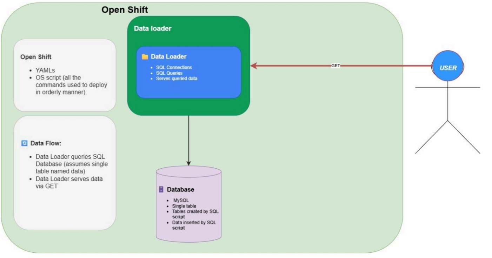

## Cloud Data Loader with FastAPI, MySQL, and OpenShift

A fully containerized backend service built with **FastAPI** that retrieves and serves all records from a single MySQL
table (`data`).  
The project is deployed on **OpenShift**, using Kubernetes manifests for deployments, persistent storage, and routing.  
It demonstrates clean project structure, CI/CD-friendly deployment scripts, and full end-to-end integration between
MySQL and FastAPI.

---

## 🚀 Project Overview


---
This project provisions and deploys:

1. **MySQL database** running in OpenShift with persistent volume storage.
2. **FastAPI backend service** that connects to MySQL and exposes a simple GET endpoint to return the entire contents of
   the `data` table.
3. **Data Access Layer (DAL)** for clean separation between database operations and API logic.
4. **Publicly accessible Route** in OpenShift to retrieve the data from any browser or HTTP client (Postman, curl,
   etc.).

---

## 🗂 Directory Structure

```
data-loader/
├── services/
│ └── data_loader/          # Data loading service (DAL, FastAPI app)
├── scripts/                # SQL scripts & OpenShift CLI command scripts
├── infrastructure/
│ └── k8s/                  # Kubernetes (OpenShift) YAML manifests
├── Dockerfile              # Docker image for FastAPI app
├── test.py                 # test code to run FastAPI server locally
└── README.md               # Project documentation
```

---

## 📑 Features

- **FastAPI REST API** exposing data from MySQL.
- **MySQL deployment on OpenShift** with persistent volume claim (PVC).
- **Secrets / Environment Variables** for secure database connection configuration.
- **Clean code architecture** with a dedicated Data Access Layer.
- **Automated database initialization scripts** for table creation and data seeding.
- **Dockerized** for portability and easy deployment.
- **Kubernetes manifests** for declarative infrastructure provisioning.
- **OpenShift Route** for public access to the API.

---

## ⚙️ Tech Stack

- **Backend Framework:** [FastAPI](https://fastapi.tiangolo.com/)
- **Database:** MySQL 8.x
- **Containerization:** Docker
- **Orchestration:** Kubernetes (OpenShift)
- **Deployment:** OpenShift CLI & YAML manifests
- **Language:** Python 3.9

---

## 📋 Prerequisites

Before starting, ensure you have:

- **Docker Hub account** (for pushing/pulling images).
- **OpenShift CLI (`oc`)** installed and logged in.
- **Python 3.9+** installed locally for development.
- **Docker** installed and running.

---

## 📡 API Usage

### Endpoint:

```http request
GET /get-all
```

### Description:

Returns all rows from the `data` table in JSON format.

### Example Response:

```json
[
  {
    "id": 1,
    "first_name": "John",
    "last_name": "Doe"
  },
  {
    "id": 2,
    "first_name": "Jane",
    "last_name": "Smith"
  }
]
```

---

### 🗄 Database Structure

| Column    | Type        | Notes       |
|-----------|-------------|-------------|
| id        | INT         | PRIMARY KEY |
| firstName | VARCHAR(50) | NOT NULL    |
| lastName  | VARCHAR(50) | NOT NULL    |

---

## 📜 Scripts

Inside `scripts/` you will find:

- **commands.bat** -> All CLI commands for building, deploying, and configuring the project.
- **create_data.sql** -> SQL script to create the `data` table.
- **insert_data.sql** -> SQL script to insert sample data.

---

## 🌍 Accessing the API

Once deployed, the **OpenShift** Route will provide a public URL:

```arduino
https://<your-app-route>/get-all
```

Open it in your browser or use:

```bash
curl https://<your-app-route>/get-all
```